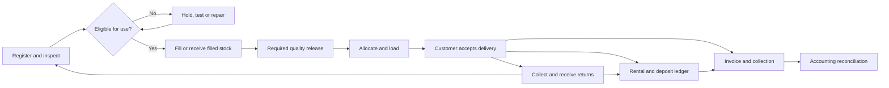

# Oxygen cylinder operations: discovery and proposed product plan

Research date: 28 September 2026. Status: discovery draft, not an approved implementation specification.

## 1. What this investigation establishes

The reference is a broad gas-business ERP, rather than just a cylinder register. Its public product, module, resources and FAQ pages advertise operations, finance, field mobility and integrations. Android and iPhone store listings exist. Those observations establish public product positioning, not successful execution of the workflows, verified security, customer outcomes, or the internal architecture.

The local project directory was empty and was not a Git repository when inspected. There is no existing source code to reverse engineer. Research has stayed within public material; no private account, database, production transaction, security assessment, or vendor contact was used.

This document proposes an original product for the client. It does not claim that the reference implements the proposed safeguards. Supporting reports in `docs/research` supply vendor evidence, Indian regulatory discovery and workflow/security analysis. Any unverified applicability remains a discovery question.

**The central objective:** make every cylinder movement accountable, every commercial charge explainable, and the common jobs easy enough for real dispatch staff and drivers to perform consistently.

## 2. Evidence and completeness boundaries

| Evidence class | Meaning | Permitted conclusion |
|---|---|---|
| Public page observed | Read in the rendered website or published document | The vendor advertises this capability |
| Store listing observed | Published mobile listing exists | A mobile product is publicly listed; functionality untested |
| Authoritative external guidance | Official regulator or integration/security documentation | A requirement or supported pattern, subject to applicability/version |
| Proposed requirement | Our recommended design | Must be validated with the client and tested in our software |
| Unknown | Requires demo, process owner, sample data or a contract | Do not invent a default and call it verified |

“Everything” cannot responsibly mean inaccessible private behavior. Full understanding requires a permitted demonstration and real client operations. The closure checklist is: catalogue public surfaces; map each capability to an operational job; capture inputs, outputs, permissions and exceptions; validate examples with the client; test the resulting design. Unknowns remain visible until resolved.

Useful public entry points: [home](https://ctmsgas.com/), [product](https://ctmsgas.com/product), [modules](https://ctmsgas.com/erp-modules), [resources](https://ctmsgas.com/resources), [FAQ](https://ctmsgas.com/faq). These are marketing sources, not independent product audits.

Coverage at the end of this pass: 295 sitemap URLs inventoried; 25 rendered public pages reviewed; four blog search excerpts sampled; 266 routes discovered but not read. All 55 questions across the 11 FAQ categories were read. The four-page brochure was text-extracted, with visual inspection of pages 2 and 4. Three video embeds were identified but not watched. The route CSV and evidence report retain the exact remaining coverage; this is not a claim to have read every article or tested the private application.

## 3. Business branches that change the product

The client’s operating model is not yet confirmed. These are distinct scope branches, not interchangeable labels:

1. **Distributor/trader:** purchase or receive full cylinders, deliver, recover empties, send to an external filler, reconcile supplier custody and charges.
2. **Filler/manufacturer:** additionally control filling eligibility, batches, operators, inspections, quality release, source-gas receipts and production reconciliation.
3. **Medical oxygen supplier:** additionally establish the applicable licensed operations, quality records, batch traceability and recall process. Hospitals as customers do not automatically justify collecting patient medical records.
4. **Home-care supplier:** may additionally need delivery addresses, contact permissions, deposits, accessories, swaps, pickup scheduling and sensitive-data minimization.
5. **Multiple gases or liquid supply:** requires gas-specific compatibility and units; tank telemetry, bulk liquid deliveries, and cryogenic assets are separate workstreams if actually needed.

Confirm whether this is one company’s internal system or a commercial SaaS for many companies. Multi-branch access inside one legal company is not the same problem as isolation between unrelated businesses.

The reference also advertises ward/patient allocation, home-care subscriptions, hospital consumption and bulk liquid oxygen functions. Treat these as separate applicability questions. A supplier's ERP should not acquire clinical patient records or hospital-internal workflows merely to reproduce a competitor's feature list.

## 4. Recommended approach and alternatives

| Approach | Advantages | Costs and risks | Fit |
|---|---|---|---|
| Purpose-built operations product connected to the client’s accounting system | Best control over custody, scanning, rentals and simple daily workflows | Own the integration and migration work | Recommended provisional direction |
| Configure an established ERP and add a cylinder extension | Reuses finance, purchasing and administrative workflows | Serialized custody and offline UX can become awkward customizations | Evaluate if the client already has a suitable ERP |
| Build an entire accounting and gas ERP at once | Maximum long-term ownership | Large accounting, statutory, migration and support burden before operations improve | Avoid as the first release unless mandatory |

Recommendation: build one reliable end-to-end operating loop first. Keep the accounting system as the agreed financial authority while our application owns cylinder custody and operational evidence. Determine invoice ownership per document type; never allow two systems to independently issue or edit the same authoritative invoice.

## 5. Product map: jobs, records and failure cases

All rows below are proposed coverage, not a claim of implemented functionality.

| ID | Area and daily job | Records and output | Critical exceptions |
|---|---|---|---|
| M01 | Set up companies and branches | Legal entity, GST registrations, locations, document series, users | Intercompany transfer versus branch transfer; access to the wrong company |
| M02 | Register cylinders and accessories | Stable internal ID, manufacturer serial, owner, gas service, capacity/unit, certificates, tag mapping | Duplicate serials across manufacturers, unknown owner, unreadable tag, tag replacement |
| M03 | Set up customers and suppliers | Legal party, multiple sites, contacts, tax details, price contract, credit terms | Hospital group with separate sites; payer differs from recipient; inactive party |
| M04 | Quote and accept orders | Quote versions, order lines, delivery site, promised date, source and priority | Split fulfillment, cancellation, substitution, customer pickup, urgent order |
| M05 | Plan dispatch and reserve stock | Eligible cylinders, picking list, route, vehicle, driver | Double allocation, test overdue, wrong gas/type, credit hold, stock shortage |
| M06 | Load and hand over | Scanned manifest, transfer event, challan and acknowledgement | Wrong vehicle, loading cancellation, missing units, unscheduled addition |
| M07 | Deliver and collect empties | Accepted/rejected serials, site, recipient evidence, return pickup | Partial delivery, site closed, refusal to sign, alternate recipient, unrelated empties |
| M08 | Receive and inspect returns | Receiving evidence, owner/custody reconciliation, condition, inspection result | Full return, residual gas, leaking/damaged item, foreign cylinder, disputed balance |
| M09 | Send to and receive from an external filler | Vendor transfer, serials, expected return, filled receipts, charges | Partial receipt, substituted cylinder, ownership mismatch, failed inspection |
| M10 | Fill and release batches, if applicable | Eligible input cylinders, batch, operator, process evidence, quality decision | Batch fails, interrupted fill, missing certificate, suspected contamination, recall |
| M11 | Test, repair and retire | Work order, service provider, evidence, result, next due basis, retirement | Failed test, overdue certificate, conflicting dates, condemned asset reappears |
| M12 | Charge rental and manage deposits | Contract versions, custody intervals, preview, holding charges, deposit ledger | Free days, slabs, partial returns, cutoff dispute, waiver, lost cylinder, refund |
| M13 | Invoice and correct financial documents | Draft/final document, tax breakdown, credits/debits, accounting reference | Rounding, rejected external registration, cancelled issue, rate changed retrospectively |
| M14 | Collect and allocate money | Cash/UPI/bank/cheque receipt, reference, invoice allocations, settlement | Partial/unallocated payment, duplicate receipt, failed cheque, cash shortage |
| M15 | Close trips and reconcile each day | Vehicle count, customer balance, cash handover, discrepancies | Delivered but not synced, missing return, unsolved count mismatch, duplicate event |
| M16 | Monitor and recover | Idle assets, receivables, rental ageing, test due, exception queue | Stale offline data, misleading “live” indicators, disputed overdue balance |
| M17 | Notify and expose portals | Message status, authorized documents, customer requests | Wrong recipient, shared phone, opt-out, failed delivery, expired links |
| M18 | Import, export and integrate | Mapping, validation, dry run, batch outcome, retry/reconciliation | Dirty spreadsheets, duplicate masters, partial import, repeated webhook, unavailable Tally |

Scope later unless validated: HR/payroll, general procurement ERP, fleet fuel/servicing, optimized routing, vendor self-service, tank sensors and predictive analytics. Track them explicitly rather than quietly omitting them or bundling them into launch.

## 6. The operating loop in detail

This is the normal loop. Rejections, partial receipts, quarantine, retirement and disputes need the separate paths described below; they must not be forced into successful delivery or refill states.

### 6.1 Establish opening truth

Physically count sample stock and reconcile current customer/supplier holdings before importing. Import cylinders, owners, branches, customer sites, open challans, deposits, receivables and rental start evidence as separate datasets. Preserve the source file, row reference and import batch. Mark uncertain opening holdings as unresolved; never fabricate historic scan events to make a spreadsheet balance appear proven.

Duplicate detection must account for manufacturer and serial identity, not assume a serial string is globally unique. Missing serials need a supervised identification process. An asset’s internal identity remains stable when its QR/RFID tag is replaced; previous mappings remain in its history.

### 6.2 Order → pick → load

Choose customer/site and requested gas/size; apply the effective commercial agreement. Reserve eligible stock atomically. Show availability broken down by ready, reserved, quarantine, test/repair, vehicle, customer and vendor custody. A quantity is not enough when individual cylinders must be traceable.

Scan the actual units onto a vehicle or into customer pickup custody. Compare the actual manifest with the order. Require authorized resolution for mismatches; prevent the same cylinder being assigned to two active dispatches. Confirm before posting the movement, then produce the relevant document from the committed transaction.

### 6.3 Deliver → accept → return pickup

Separate dispatch from acceptance at the customer. The driver records exactly what was accepted, rejected or not delivered. Proof may use recipient name/signature/photo or a customer-approved alternative; OTP is not the only permissible fallback and may fail in poor connectivity. Capture the reason and authority for exceptions.

Empty pickup is a separate movement, even when it happens on the same visit. Returning five cylinders does not prove they are the same five most recently delivered. Identify each unit and its owner. Do not alter ownership because another customer returned it.

### 6.4 Receive → inspect → refill or hold

Warehouse receipt confirms the actual items returned by the driver. The receiving inspection determines the next permitted action. “Empty” is a content state, not proof of safety or filling eligibility. Route damage, doubtful identity, contamination concerns and expired/missing test evidence to a hold workflow. Authorized competent staff define the technical acceptance criteria; software records and enforces them.

### 6.5 Bill → collect → close

Preview gas charges, delivery charges and rental separately. A deposit is a separately tracked balance, not automatically revenue. Show why each rental line exists: cylinder or agreed pool, charge period, free days, contract version, rate and adjustment.

Finalize documents through the agreed accounting/statutory workflow. Queue external delivery and synchronization after the core transaction commits. A WhatsApp outage must not roll back an otherwise valid physical delivery. Reconcile failed integrations visibly. Close the driver’s trip only when remaining vehicle stock, delivered stock, collected returns and collections reconcile or have approved discrepancies.

## 7. Data model and rules that must never break

### 7.1 Independent dimensions

Each cylinder has an identity plus independently recorded dimensions:

- **Owner:** company, customer, supplier or other verified party.
- **Custodian:** the party currently responsible for possession.
- **Last verified location:** branch, vehicle, vendor or customer site, with evidence time and source.
- **Contents:** gas/service designation, empty/full/partial/unknown and batch where applicable.
- **Serviceability:** eligible, inspection required, quarantined, testing, repair or retired.
- **Allocation:** unreserved, reserved or committed to a pending movement.

Do not compress these into one `status` field. “Customer-owned, empty, at our plant, quarantined” is a valid combined condition. GPS from a truck does not turn a past cylinder scan into a current cylinder location.

### 7.2 Core records

Organization → legal entity → branch/location; user → role → permitted scope; party → delivery/billing sites; cylinder → identifiers/attachments; gas product → explicit unit and specification; movement → serialized lines and custody evidence; order → allocations; trip → stops/manifests; inspection/test/repair; fill batch → released cylinders; contract → effective rates; rental calculation run → input snapshot; invoice/credit/debit; deposit and receipt/allocation; import batch; integration job; immutable audit event.

Relationships should allow one order to have multiple deliveries, one trip to serve multiple customers, one invoice to cover multiple allowed source documents, and one payment to allocate across invoices. Preserve links for corrections and disputes. Do not use destructive cascading deletion for finalized business evidence.

### 7.3 Invariants

1. A serialized cylinder cannot have two accepted current custody assignments.
2. Counts reconcile to the underlying serials; serialized and quantity-only records never silently mix.
3. Content changes and custody changes are separate events with separate authorization.
4. Retired or quarantined assets cannot re-enter normal dispatch through a bulk import or alternative endpoint.
5. Concurrent requests cannot consume the same allocation twice.
6. A retry produces one logical movement, invoice or receipt, not duplicates.
7. Issued documents have controlled correction/reversal paths; their original evidence remains accessible.
8. Rental calculation uses effective contract versions and agreed day boundaries; recalculation is explainable.
9. Money uses decimal amounts and explicit rounding rules; unit conversions are explicit and versioned.
10. Every mutation enforces actor, organization and branch scope on the server.
11. Client clocks are evidence, not the sole authority for event order. Store capture time and server receipt time.
12. Unknown identity, ownership or safety data stays visibly unknown until resolved.

## 8. Offline behavior is a core design decision

An app should show distinct states: saved on device, submitted, accepted by server, and needs resolution. “Saved” cannot imply “posted.” Limit offline data to assigned work and the minimum necessary party details. Establish device registration, session expiry and local retention.

Each operation needs a stable ID, expected record version, actor/device, capture time and payload. The server checks current permissions and business rules when it receives the operation. Duplicate submissions return the original outcome. Conflicting custody is sent to a resolution queue, never settled by silently overwriting the latest value.

Offline physical work has limits: a stale phone cannot prove that the plant has not just quarantined a cylinder. Agree which tasks can be performed under bounded offline authorization and which require online validation or a documented manual contingency. Capture critical incidents immediately when connectivity returns. Revocation cannot erase data from a disconnected lost device instantly; minimize cached data and make that limitation explicit.

Pilot QR scanning on the actual inexpensive phones, label material, lighting and network conditions. RFID requires separate hardware testing for adjacent-cylinder reads, missed tags, duplicate reads and gate direction. Do not purchase hardware or promise throughput from website claims.

## 9. Security and accountability

Security design must cover business abuse as well as login attacks. Proposed controls:

| Risk | Control | Evidence required before launch |
|---|---|---|
| Driver sees other customers or price margins | Assignment/branch scope and field-level restrictions | Direct API and export authorization tests |
| Branch user accesses another company by changing an ID | Server-enforced isolation for records, files, searches and jobs | Cross-company negative tests |
| Shared admin credentials hide responsibility | Individual accounts, least privilege, stronger admin authentication | User lifecycle and session revocation demonstration |
| Staff changes a rate or refunds own adjustment | Scoped permissions, thresholds, reason and independent approval where needed | Self-approval and alternate-path tests |
| Signed certificate replaced unnoticed | Private versioned files, integrity metadata, audit attribution | Old version retrieval and access tests |
| Rental history edited to hide a loss | Append-only business events plus separately protected audit storage | Correction trail and tamper detection review |
| QR copied from a cylinder exposes customer data | Non-sensitive opaque identifier; authentication for private lookup | Anonymous scan returns no customer/financial details |
| Lost field phone leaks customer records | Minimal encrypted local data, device/session controls, time-bounded access | Offline expiry/lost-device exercise |
| Integration credential stolen | Server-side secret management, rotation, restricted access | No secrets in mobile/frontend/logs |
| Malicious attachment or spreadsheet formula | File validation/private delivery; safe export/import handling | Adversarial upload and CSV export cases |
| Ransomware or accidental deletion | Encrypted independent backups, restore rehearsals, retention policy | Timed full restore with attachment reconciliation |
| Integration lies about payment or delivery | Verify provider callbacks, deduplicate, reconcile authoritative status | Forged and replayed callback tests |

Audit entries need actor, role/scope, time, affected record, action, before/after reference, reason, approval and request correlation. Do not write passwords, tokens or unnecessary personal information into logs. An application table labelled “audit” is not automatically tamper-proof against administrators.

Set recovery point and recovery time targets with the client, then prove them. Daily backups alone may lose a full day of operations. Security requirements and applicability references are expanded in the supporting reports; a production security review remains necessary after implementation.

## 10. Make the interface easy for the people doing the work

Organize the experience by role and job, not the database schema:

| Role | Default screen | Primary actions |
|---|---|---|
| Owner/manager | Today’s exceptions and business position | Shortage, overdue recovery, failed sync, approvals |
| Dispatch clerk | Orders ready to send | Pick, scan, load, print/share challan |
| Driver | Assigned route and current stop | Deliver, collect empties, record collection, show sync status |
| Storekeeper | Receive and reconcile | Scan return, inspect, identify discrepancy |
| Filling/quality team | Eligible work and held batches | Record fill, inspect, release or hold |
| Accountant | Documents and collection exceptions | Review charges, issue, allocate payment, reconcile accounting |
| Customer, later if needed | Own balances and requests | View documents, request refill/pickup, flag a dispute |

Use familiar labels such as “Send cylinders” and “Receive empties,” with the client’s preferred document terminology. Do not expand DC/ECR/FRC/ETM by guessing; validate the precise meaning and accounting effect of each document with the client.

Use one obvious primary action, scan continuously without repeated dialogs, show count plus serials, make wrong scans audibly and visibly distinct, and preserve in-progress work. Keyboard shortcuts help office staff; large touch targets and low typing help field staff. Never use colour alone for safety state.

Defaults should come from customer/site agreements and the assigned trip. Dangerous defaults—gas identity, test eligibility, recipient, refund amount—must remain explicit. Errors should explain the issue and the permitted recovery action, not expose technical exceptions.

Localization proposals to validate: English plus the actual staff language; INR and Indian digit grouping; India-standard business dates/times; flexible phone formatting; local address conventions; A4 and existing thermal-printer formats. Store timestamps consistently and render with the agreed business timezone. Do not assume the client speaks Hindi solely because the business is Indian.

Measure usability with observed tasks: unfamiliar staff completes a routine dispatch, driver completes partial delivery and empty pickup, accountant explains a rental line, and storekeeper resolves an unknown cylinder. Set numerical targets after timing the current process and a prototype; avoid invented “three-click” guarantees.

## 11. Architecture direction, deliberately provisional

Prefer a modular application with a transactional relational store, private document storage and background integration workers. Logical modules separate identity/access, asset custody, commercial contracts, production/quality, finance documents and integrations. Use a transaction/outbox boundary so a committed movement reliably produces downstream work without relying on a fragile chain of live third-party calls.

A responsive office interface and a field mobile experience should share validated business rules at the service boundary. Choose web/PWA versus a native mobile application after testing offline durability, camera performance, background sync, printers and any RFID SDK on the actual devices. Framework, cloud vendor and package versions remain unselected until those constraints and operating budget are known.

Do not start with microservices or rebuild a general ledger simply for architectural fashion. Keep the operational model modular enough to grow while reducing the number of systems a small support team must operate.

## 12. Integration contracts to resolve before coding

| Integration | Decision needed | Failure behavior |
|---|---|---|
| Accounting/Tally | Exact installed version, network access, authoritative masters/documents, mapping | Retry queue, visible failure, manual reconcile; no duplicate vouchers |
| GST services | Client applicability, authorized provider, credentials and sandbox | Pending/failed status; no fake success or invented government API |
| WhatsApp | Manual sharing versus business API, consent, templates, costs | Delivery history, retry bounds, opt-out handling; no “unlimited free” assumption |
| Payments | Record payments only or gateway collection; authoritative settlement | Pending versus settled, duplicate reference detection, reconciliation |
| Printer/scanner/RFID | Model, protocol/SDK, labels and volumes | Manual fallback with audit; failed read never means successful movement |
| GPS/maps | Vehicle telemetry supplier and legitimate operational purpose | Stale indicator; never infer every cylinder’s location from an unverified truck association |

Phase 0 must read the selected integration’s current official examples and pin supported versions. There is no approved API inventory yet because providers and installed products have not been selected. Agents must not invent endpoints, parameters or SDK methods.

## 13. Phased delivery plan and gates

This is a proposed sequence, not a promised schedule. Medical/production quality functions move into the initial operational release if the client’s activities require them; they are not optional polish.

| Phase | Deliverable | Verification gate | Reference and anti-pattern guard |
|---|---|---|---|
| 0 — Learn and validate | Client workflow interviews, representative documents, evidence matrix, compliance applicability, hardware survey, integration docs | Process owners agree on one normal cycle and exception cases; unresolved items have owners | Supporting research; use official versioned docs, no invented APIs |
| 1 — Prototype the daily jobs | Role-specific dispatch/return/billing prototypes with realistic anonymous cases | Staff completes tasks; terminology, printer formats and offline states validated | Sections 6, 8, 10; no visual polish that hides missing business rules |
| 2 — Build trusted foundations | Access scope, masters, imports, cylinder identity, events, files, audit, backups | Import dry run, cross-scope denial, duplicate identity and restore tests pass | Sections 7, 9; never trust client-only permissions |
| 3 — Complete one operating loop | Order, stock allocation, dispatch, acceptance, returns, inspection, trip close, required fill/quality work | Serial-by-serial stock/custody reconciles across partial delivery, returns and concurrency | Workflow report; no quantity-only shortcuts for serialized movements |
| 4 — Make money reconcile | Effective contracts, rental preview, deposits, invoices, receipts and accounting integration | Accountant independently reproduces sample totals and reconciles source documents | India report + chosen accounting docs; do not overwrite finalized history |
| 5 — Prove field reliability | Offline operations, conflict handling, target hardware and recovery paths | Network loss, stale device, repeated scan and partial sync tests pass | Section 8; no last-write-wins custody resolution |
| 6 — Pilot with one branch/route | Verified opening balances, training, parallel reconciliation and support runbook | All unexplained stock/financial differences resolved or explicitly accepted; rollback rehearsed | Client-approved checklist; migration success means reconciliation, not import completion |
| 7 — Expand and optimize | Additional branches, portals, RFID, advanced production/fleet features if justified | Regression, capacity, privacy/security and operational acceptance per added scope | Current official docs and measured pilot evidence; no feature-only release gate |

Prototype → operational model → real cycle → money reconciliation → field proof → controlled rollout. Core offline constraints must influence the foundation even if broad field rollout comes later.

## 14. Acceptance scenarios before any production rollout

1. Register company-owned and customer-owned cylinders with similar serial text without merging them.
2. Replace a damaged QR tag while retaining complete cylinder history; old tag cannot silently identify another asset.
3. Two dispatch clerks attempt to reserve the same cylinder; only one succeeds.
4. Load ten, customer accepts eight, two remain in vehicle custody; the order and charges reflect the actual outcome.
5. Pick up six empties including a foreign cylinder; legitimate returns reconcile and the foreign item enters a resolution workflow.
6. Receive a returned full cylinder without marking it empty or ready to refill.
7. Quarantine a damaged cylinder; dispatch is blocked through UI, API, bulk upload and offline reconciliation.
8. Return part of a rental fleet across a month boundary; independently calculate free days, slabs and return-day treatment.
9. Change a customer’s future rental rate; a finalized historic statement remains reproducible.
10. Collect cash plus a partial bank payment; customer balance, allocations and driver handover all agree.
11. Correct an issued document through an authorized linked adjustment without erasing the original.
12. Submit the same offline delivery repeatedly; exactly one accepted custody event exists.
13. Two disconnected devices claim incompatible movements; neither silently destroys the other’s evidence.
14. Revoke a driver while a device is disconnected; demonstrate the agreed offline-access limitation and rejection on reconnect.
15. Accounting or messaging is unavailable; physical workflow remains recorded and the retry queue is visible.
16. Try accessing another branch/company’s cylinder, attachment, customer portal and export directly; access is denied.
17. Restore data and documents into a clean environment; reconcile sample movements and financial balances.
18. Recall a released batch, if applicable; find affected cylinders, current known custodians and subsequent events, with stale-data warnings.
19. Import a spreadsheet twice; duplicate business objects are not created, and rejected rows explain their errors.
20. Cancel or reverse a transfer that already has downstream movements; the system requires a valid compensating workflow.

## 15. Success measures and cost drivers

Agree baseline and target for: unexplained cylinder variance; age of unresolved customer holdings; time per dispatch/return; percent movements with verified serials; rental disputes; overdue receivables; day-end reconciliation time; failed/unresolved integrations; offline conflicts; recovery drill duration; user task completion without help.

Compare numbers with the same definitions over time. Report data freshness and denominator. A dashboard’s attractive “live” badge is not proof of complete data.

Major cost drivers are hardware, labels, migration cleanup, native field app needs, statutory/accounting integration, branch count, training/support and hosting/backup requirements. We should estimate implementation after the client supplies fleet scale, daily movement volumes and critical integrations. Vendor marketing fleet sizes or ROI calculators are not reliable project estimates.

## 16. Information needed from the client

Start with the operating model. Then work through the prioritized interview and sample checklist in `client-discovery-checklist.md`. Access to an authorized CTMS demo or a client-led recording would let us inspect actual screens and exception behavior. Public pages alone cannot close that gap. Login credentials should be entered by the account holder in the browser, not pasted into research documents.

The next deliverable after those answers is a client-specific scope and screen/workflow specification, followed by an implementation plan with selected technologies, exact API references, executable tasks and agreed launch gates. No application implementation has begun.
